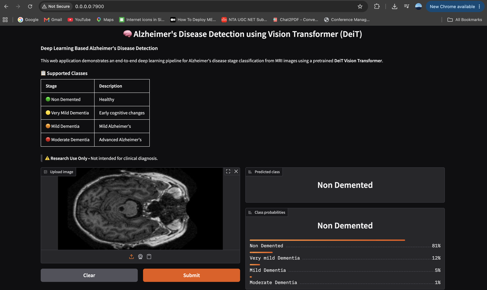

# 🧠 Alzheimer's Disease Detection using Vision Transformer (DeiT)

A deep learning web application for **Alzheimer's disease stage classification** from brain MRI images using a **Data-efficient Image Transformer (DeiT)** model built with **PyTorch**, **timm**, and **Gradio**.

---

<p align="center">
  
</p>

## 📌 Overview

This project demonstrates an end-to-end deep learning pipeline that classifies brain MRI images into one of four Alzheimer's disease stages using a pretrained **Vision Transformer (DeiT)** model.

The application provides an intuitive web interface where users can upload an MRI image and receive:

- Predicted Alzheimer's disease stage
- Prediction confidence for each class

> **Research Prototype:** This project is intended for research and educational purposes only.

---

## 🚀 Features

- ✅ Vision Transformer (DeiT) based classification
- ✅ Interactive Gradio web interface
- ✅ Automatic model download on first launch
- ✅ Confidence score for every class
- ✅ CPU and GPU support
- ✅ Easy local deployment
- ✅ Cross-platform (Windows, Linux, macOS)

---

## 🧠 Model

**Architecture:** DeiT (Data-efficient Image Transformer)

**Framework:** PyTorch + timm

**Input Size:** 224 × 224 RGB MRI Images

**Output Classes:**

- 🟢 Non Demented
- 🟡 Very Mild Dementia
- 🟠 Mild Dementia
- 🔴 Moderate Dementia

---

## 🖥️ Demo

Upload a brain MRI image and the application predicts the Alzheimer's disease stage.

<p align="center">

*(Add a screenshot or GIF here)*

</p>

---

## 📂 Project Structure

```text
deit-oasis-web-app/
│
├── app.py
├── requirements.txt
├── README.md
├── classes.txt
├── .gitignore
│
├── examples/
│
└── models/
```

---

## ⚙️ Installation

Clone the repository

```bash
git clone https://github.com/YOUR_USERNAME/deit-oasis-web-app.git

cd deit-oasis-web-app
```

Install dependencies

```bash
pip install -r requirements.txt
```

Run the application

```bash
python app.py
```

---

## 📥 Automatic Model Download

The trained model is **not stored in the repository** because of GitHub's file size limitations.

When the application is launched for the first time, it automatically downloads the pretrained model (~330 MB) from the project's GitHub Release.

Subsequent runs use the locally cached model.

---

## 📊 Prediction Pipeline

```text
Brain MRI
     │
     ▼
Image Preprocessing
     │
     ▼
Resize (224 × 224)
     │
     ▼
DeiT Vision Transformer
     │
     ▼
Softmax
     │
     ▼
Predicted Alzheimer's Stage
```

---

## 🛠️ Technologies Used

- Python
- PyTorch
- timm
- TorchVision
- Gradio
- Pillow

---

## 💡 Future Improvements

- Support multiple Vision Transformer architectures
- Explainable AI (Grad-CAM / Attention Maps)
- Batch prediction
- Docker deployment
- Cloud deployment
- Clinical validation on external datasets

---

## 📄 Research

This project was developed as part of research on Vision Transformers for Alzheimer's disease classification from MRI images.

---

## ⚠️ Disclaimer

This software is intended **only for research and educational purposes**.

It is **not a medical device** and **must not be used for clinical diagnosis, treatment planning, or patient care**.

Predictions generated by this application should always be interpreted by qualified healthcare professionals.

---

## 📜 License

This project is released under the **MIT License**.

---

## 👨‍💻 Author

**Manav Gupta**

M.Tech Computer Science

Deep Learning • Computer Vision • Medical AI

---

⭐ If you found this project useful, consider giving it a star!